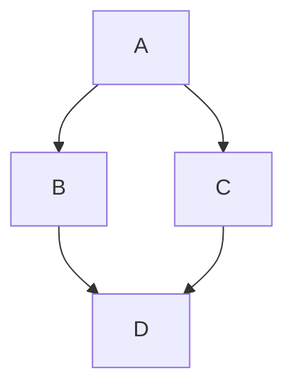
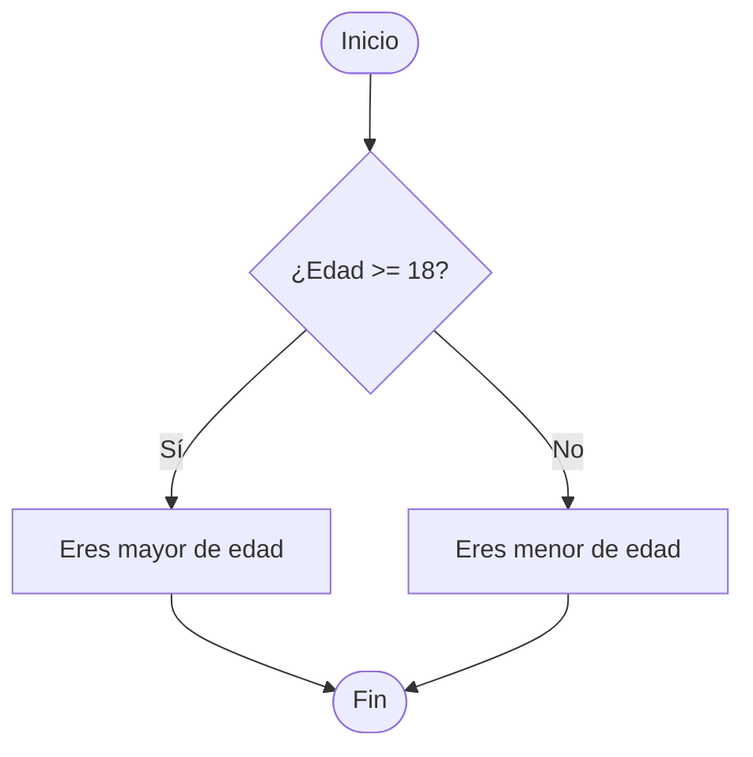

# graficos mermaid
Agregar extension *Mermaid Chart* del equipo de mermaid.

```mermaid
graph TD;
    A-->B;
    A-->C;
    B-->D;
    C-->D;
```

```mermaid
flowchart TD
    Inicio([Inicio]) --> Edad{¿Edad >= 18?}
    Edad -->|Sí| Mayor["Eres mayor de edad"]
    Edad -->|No| Menor["Eres menor de edad"]
    Mayor --> Fin([Fin])
    Menor --> Fin
```